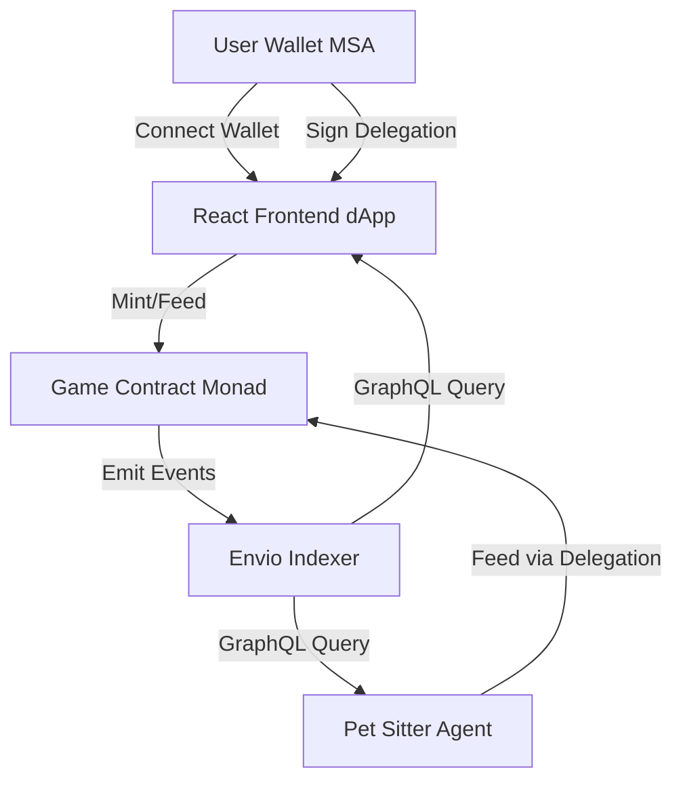

# Design Document

## Overview

Monadgotchi is a three-tier application consisting of:

1. **Smart Contract Layer** - Solidity contracts on Monad testnet managing pet NFTs and game logic
2. **Indexing Layer** - Envio indexer providing real-time hunger data via GraphQL
3. **Application Layer** - React frontend and Node.js Pet Sitter Agent

The system demonstrates "set it and forget it" automation where users delegate feeding permissions to an agent that monitors hunger levels through indexed events.

## Architecture



### System Flow

1. User mints Monadgotchi NFT through frontend
2. Contract emits PetMinted and PetHungerUpdated events
3. Envio indexes events and updates GraphQL database
4. User grants delegation to Pet Sitter Agent via MSA signature
5. Agent polls Envio every minute for hungry pets (hunger >= 90)
6. Agent calls feed() using delegated permissions
7. Frontend displays real-time pet status from Envio queries

## Components and Interfaces

### 1. Game Contract (Solidity)

**File:** `contracts/Monadgotchi.sol`

**Core State:**

```solidity
struct Pet {
    uint256 tokenId;
    address owner;
    uint256 hunger;
    uint256 lastFeedBlock;
    bool isFainted;
}

mapping(uint256 => Pet) public pets;
uint256 public nextTokenId;
uint256 public constant HUNGER_INCREASE_RATE = 1; // per 10 minutes
uint256 public constant BLOCKS_PER_10_MIN = 100; // Adjust for Monad block time
uint256 public constant MAX_HUNGER = 100;
```

**Key Functions:**

```solidity
function mint() external returns (uint256)
function feed(uint256 petId) external
function getCurrentHunger(uint256 petId) public view returns (uint256)
function getPetStatus(uint256 petId) public view returns (Pet memory)
```

**Events:**

```solidity
event PetMinted(uint256 indexed petId, address indexed owner, uint256 timestamp);
event PetHungerUpdated(uint256 indexed petId, uint256 newHungerLevel, uint256 timestamp);
event PetFainted(uint256 indexed petId, uint256 timestamp);
event PetFed(uint256 indexed petId, address indexed feeder, uint256 timestamp);
```

**Hunger Calculation Logic:**

- Hunger increases passively based on block time elapsed since lastFeedBlock
- Calculated on-demand in getCurrentHunger() view function
- Updated on-chain only when feed() is called or when queried
- Formula: `currentHunger = min(lastHunger + (blocksPassed / BLOCKS_PER_10_MIN), MAX_HUNGER)`

**Access Control:**

- feed() checks: `msg.sender == pet.owner || hasDelegation(msg.sender, petId)`
- Delegation verification through MSA delegation framework
- Only owner can mint new pets

### 2. Envio Indexer

**File:** `envio/config.yaml`

**Indexed Events:**

- PetMinted
- PetHungerUpdated
- PetFainted
- PetFed

**GraphQL Schema:**

```graphql
type Pet {
  id: ID!
  petId: BigInt!
  owner: String!
  hunger: Int!
  lastFeedBlock: BigInt!
  lastFeedTimestamp: BigInt!
  isFainted: Boolean!
  createdAt: BigInt!
}

type Query {
  pet(petId: BigInt!): Pet
  pets(where: PetFilter, orderBy: PetOrderBy, limit: Int): [Pet!]!
  hungryPets(minHunger: Int!): [Pet!]!
}

input PetFilter {
  owner: String
  hunger_gte: Int
  hunger_lte: Int
  isFainted: Boolean
}
```

**Key Queries:**

- `hungryPets(minHunger: 90)` - Returns pets needing immediate feeding
- `pets(where: {owner: "0x..."})` - Returns all pets for a specific owner
- `pet(petId: 123)` - Returns single pet details

**Indexing Strategy:**

- Subscribe to Game Contract events on Monad testnet
- Update pet records in real-time (< 5 second latency)
- Maintain historical feed events for transaction history
- Calculate derived fields (time since last feed, estimated current hunger)

### 3. Pet Sitter Agent (Node.js)

**File:** `agent/index.js`

**Architecture:**

```javascript
class PetSitterAgent {
  constructor(envioEndpoint, contractAddress, privateKey) {
    this.envioClient = new GraphQLClient(envioEndpoint);
    this.contract = new ethers.Contract(contractAddress, ABI, wallet);
    this.feedQueue = new Queue();
  }

  async pollHungryPets() {
    // Query Envio every 60 seconds
    const hungryPets = await this.queryHungryPets(90);
    for (const pet of hungryPets) {
      await this.feedPet(pet.petId);
    }
  }

  async feedPet(petId) {
    // Use delegated permission to call feed()
    const tx = await this.contract.feed(petId);
    await tx.wait();
    console.log(`Fed pet ${petId}: ${tx.hash}`);
  }
}
```

**Key Features:**

- Polling interval: 60 seconds
- Concurrent feeding with rate limiting (max 5 simultaneous transactions)
- Retry logic: 3 attempts with exponential backoff (1s, 2s, 4s)
- Gas estimation and dynamic gas pricing
- Logging: Winston logger with transaction history
- Health monitoring: Prometheus metrics endpoint

**Delegation Handling:**

- Agent wallet address stored in environment variables
- Uses MSA delegation framework to call feed() on behalf of users
- Validates delegation before attempting feed transactions
- Gracefully handles revoked delegations

### 4. Frontend dApp (React + Vite)

**File Structure:**

```
frontend/
├── src/
│   ├── components/
│   │   ├── PetDisplay.jsx       # Pixel art pet with animations
│   │   ├── HungerBar.jsx        # Visual hunger progress bar
│   │   ├── FeedButton.jsx       # Manual feed action
│   │   ├── DelegationButton.jsx # "Hire Pet Sitter" CTA
│   │   ├── WalletConnect.jsx    # MSA wallet connection
│   │   └── TransactionHistory.jsx # Feed event log
│   ├── hooks/
│   │   ├── useContract.js       # Contract interaction hook
│   │   ├── useEnvio.js          # GraphQL queries to Envio
│   │   └── useDelegation.js     # MSA delegation logic
│   ├── utils/
│   │   ├── contracts.js         # Contract ABIs and addresses
│   │   └── envioClient.js       # GraphQL client setup
│   └── App.jsx
```

**Key Components:**

**PetDisplay.jsx:**

- Renders pixel art sprite based on hunger level
- Animations: happy (0-49), hungry (50-89), very hungry (90-99), fainted (100)
- Uses CSS sprites or SVG animations
- Updates every 30 seconds via polling

**HungerBar.jsx:**

- Visual progress bar (0-100)
- Color coding: green (0-49), yellow (50-89), red (90-100)
- Shows numeric value and percentage
- Smooth transitions on updates

**DelegationButton.jsx:**

- Primary CTA when delegation not active
- Triggers MSA delegation signature
- Configures delegation: only feed() function, only user's petId
- Shows "Pet Sitter Active" status when delegation exists
- Provides "Revoke" option

**useEnvio.js Hook:**

```javascript
export function useEnvio(petId) {
  const [petData, setPetData] = useState(null);

  useEffect(() => {
    const fetchPet = async () => {
      const query = gql`
        query GetPet($petId: BigInt!) {
          pet(petId: $petId) {
            petId
            owner
            hunger
            lastFeedTimestamp
            isFainted
          }
        }
      `;
      const data = await envioClient.request(query, { petId });
      setPetData(data.pet);
    };

    const interval = setInterval(fetchPet, 30000); // Poll every 30s
    fetchPet();
    return () => clearInterval(interval);
  }, [petId]);

  return petData;
}
```

## Data Models

### On-Chain Data (Solidity Struct)

```solidity
struct Pet {
    uint256 tokenId;      // Unique NFT identifier
    address owner;        // Owner's wallet address
    uint256 hunger;       // Last recorded hunger (0-100)
    uint256 lastFeedBlock; // Block number of last feed
    bool isFainted;       // Fainted status flag
}
```

### Indexed Data (Envio Database)

```typescript
interface IndexedPet {
  id: string; // Database ID
  petId: bigint; // On-chain token ID
  owner: string; // Owner address
  hunger: number; // Current hunger level
  lastFeedBlock: bigint; // Block of last feed
  lastFeedTimestamp: bigint; // Unix timestamp of last feed
  isFainted: boolean; // Fainted status
  createdAt: bigint; // Mint timestamp
  feedHistory: FeedEvent[]; // Array of feed events
}

interface FeedEvent {
  id: string;
  petId: bigint;
  feeder: string; // Address that called feed()
  timestamp: bigint;
  transactionHash: string;
}
```

### Frontend State (React)

```typescript
interface PetState {
  petId: number;
  owner: string;
  hunger: number;
  lastFed: Date;
  isFainted: boolean;
  isDelegated: boolean;
  isLoading: boolean;
  error: string | null;
}
```

## Error Handling

### Smart Contract Errors

```solidity
error PetNotFound(uint256 petId);
error NotAuthorized(address caller, uint256 petId);
error PetAlreadyFainted(uint256 petId);
error InvalidPetId(uint256 petId);
```

**Handling Strategy:**

- Revert with custom errors for gas efficiency
- Frontend catches errors and displays user-friendly messages
- Agent logs errors and skips to next pet in queue

### Agent Error Handling

**Network Errors:**

- Retry with exponential backoff (3 attempts)
- Log failure and continue to next pet
- Alert monitoring system after 3 consecutive failures

**Delegation Errors:**

- Catch "NotAuthorized" errors
- Mark pet as "delegation revoked" in local cache
- Skip pet in future polling cycles
- Log for manual review

**Gas Errors:**

- Implement dynamic gas pricing (fetch from network)
- Set max gas limit to prevent runaway costs
- Fail gracefully and retry on next cycle

### Frontend Error Handling

**Wallet Connection Errors:**

- Display "Please install MetaMask" if not detected
- Prompt network switch if not on Monad testnet
- Show "Connection failed" with retry button

**Transaction Errors:**

- Display transaction status (pending, success, failed)
- Show error message from contract revert
- Provide link to block explorer for failed transactions

**Envio Query Errors:**

- Fallback to contract view functions if Envio unavailable
- Display "Loading..." state during queries
- Show "Unable to load pet data" with retry option

## Testing Strategy

### Smart Contract Tests (Hardhat/Foundry)

**Unit Tests:**

- Test mint() creates pet with correct initial state
- Test feed() resets hunger to 0
- Test getCurrentHunger() calculates hunger correctly over time
- Test access control (only owner or delegated can feed)
- Test faint condition (hunger reaches 100)
- Test event emissions

**Integration Tests:**

- Test full user flow: mint → wait → feed → verify state
- Test delegation flow with mock MSA
- Test multiple pets with different hunger levels
- Test edge cases (feeding at exactly 100 hunger)

### Agent Tests (Jest)

**Unit Tests:**

- Test Envio query parsing
- Test feed transaction construction
- Test retry logic with mocked failures
- Test delegation validation

**Integration Tests:**

- Test against local Hardhat node
- Test with mock Envio endpoint
- Test concurrent feeding of multiple pets
- Test graceful handling of revoked delegations

### Frontend Tests (Vitest + React Testing Library)

**Component Tests:**

- Test PetDisplay renders correct sprite for hunger levels
- Test HungerBar displays correct color and value
- Test DelegationButton triggers signature flow
- Test WalletConnect handles connection states

**Integration Tests:**

- Test full user flow in browser environment
- Test wallet connection and network switching
- Test delegation signature and confirmation
- Test real-time updates from Envio

### End-to-End Tests (Playwright)

**Critical Paths:**

1. Connect wallet → Mint pet → Verify pet appears
2. Manual feed → Verify hunger resets
3. Hire Pet Sitter → Wait for automation → Verify auto-feed
4. Revoke delegation → Verify agent stops feeding

## Deployment Architecture

### Smart Contract Deployment

**Network:** Monad Testnet
**Deployment Tool:** Hardhat
**Verification:** Monad block explorer

**Deployment Steps:**

1. Deploy Monadgotchi.sol contract
2. Verify contract on explorer
3. Record contract address for frontend and agent
4. Initialize contract parameters (block time constants)

### Envio Indexer Deployment

**Hosting:** Envio Cloud (or self-hosted)
**Configuration:** `envio/config.yaml`

**Setup Steps:**

1. Configure contract address and start block
2. Define event handlers for each event type
3. Deploy indexer to Envio platform
4. Verify GraphQL endpoint is accessible
5. Test queries against indexed data

### Pet Sitter Agent Deployment

**Hosting:** Cloud VM (AWS EC2, DigitalOcean, etc.) or serverless (AWS Lambda with EventBridge)
**Runtime:** Node.js 18+

**Configuration:**

```env
MONAD_RPC_URL=https://testnet.monad.xyz
CONTRACT_ADDRESS=0x...
ENVIO_ENDPOINT=https://indexer.envio.dev/...
AGENT_PRIVATE_KEY=0x...
POLL_INTERVAL_MS=60000
MIN_HUNGER_THRESHOLD=90
```

**Deployment Steps:**

1. Set up cloud VM or serverless function
2. Install Node.js and dependencies
3. Configure environment variables
4. Start agent as background service (PM2 or systemd)
5. Set up monitoring and logging

### Frontend Deployment

**Hosting:** Vercel, Netlify, or IPFS
**Build Tool:** Vite

**Configuration:**

```env
VITE_CONTRACT_ADDRESS=0x...
VITE_ENVIO_ENDPOINT=https://indexer.envio.dev/...
VITE_MONAD_RPC_URL=https://testnet.monad.xyz
VITE_CHAIN_ID=41454
VITE_AGENT_ADDRESS=0x...
```

**Deployment Steps:**

1. Build production bundle: `npm run build`
2. Deploy to hosting platform
3. Configure custom domain (optional)
4. Verify wallet connection and contract interaction

## Security Considerations

### Smart Contract Security

- **Access Control:** Strict validation of feed() callers (owner or delegated)
- **Integer Overflow:** Use Solidity 0.8+ built-in overflow protection
- **Reentrancy:** No external calls in state-changing functions
- **Gas Limits:** Reasonable limits on loops and calculations
- **Audit:** Consider third-party audit before mainnet deployment

### Agent Security

- **Private Key Management:** Store agent private key in secure environment variables or key management service
- **Rate Limiting:** Prevent excessive transaction spam
- **Gas Budget:** Set daily gas spending limits
- **Monitoring:** Alert on unusual activity (high failure rates, unexpected gas costs)

### Frontend Security

- **Wallet Security:** Never request private keys, only signatures
- **XSS Prevention:** Sanitize all user inputs and contract data
- **HTTPS Only:** Enforce secure connections
- **Delegation Scope:** Clearly communicate delegation permissions to users

## Performance Considerations

### On-Chain Performance

- **Gas Optimization:** Use view functions for hunger calculation (no gas cost)
- **Batch Operations:** Consider batch feeding in agent for gas efficiency
- **Event Indexing:** Emit minimal data in events to reduce gas costs

### Indexer Performance

- **Query Optimization:** Index frequently queried fields (hunger, owner)
- **Caching:** Cache hungry pets query results for 30 seconds
- **Pagination:** Limit query results to prevent large responses

### Frontend Performance

- **Lazy Loading:** Load pet data only when needed
- **Debouncing:** Debounce user actions to prevent excessive transactions
- **Optimistic Updates:** Show immediate UI feedback before transaction confirmation
- **Code Splitting:** Split bundle by route for faster initial load

## Monitoring and Observability

### Agent Monitoring

- **Metrics:** Pets fed per hour, transaction success rate, average gas cost
- **Alerts:** Failed transactions, low balance, high gas prices
- **Logging:** Structured logs with transaction hashes and pet IDs

### Contract Monitoring

- **Events:** Track all emitted events for anomalies
- **State:** Monitor total pets minted, active pets, fainted pets
- **Gas Usage:** Track average gas per function call

### Frontend Monitoring

- **User Analytics:** Track wallet connections, mints, feeds, delegations
- **Error Tracking:** Log frontend errors and failed transactions
- **Performance:** Monitor page load times and API response times
